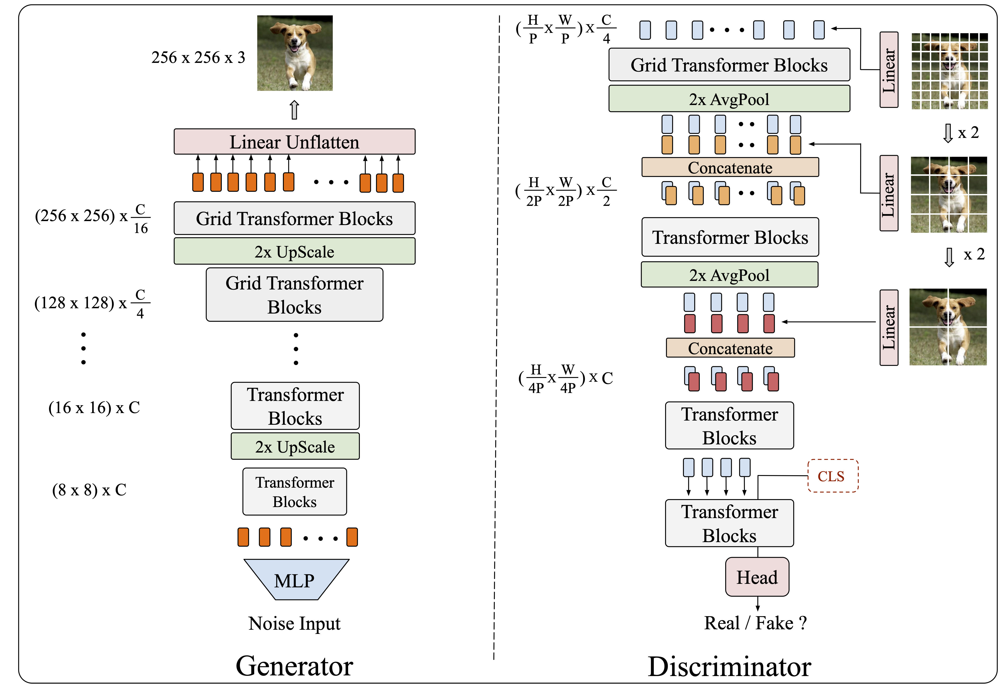
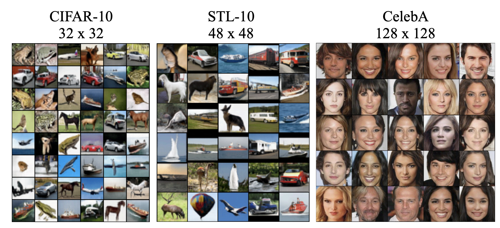

# TransGAN: Two Pure Transformers Can Make One Strong GAN, and That Can Scale Up
Code used for [TransGAN: Two Pure Transformers Can Make One Strong GAN, and That Can Scale Up](https://arxiv.org/abs/2102.07074). 

## Implementation
- [ ] checkpoint gradient using torch.utils.checkpoint
- [ ] 16bit precision training
- [x] Distributed Training (Faster!)
- [x] IS/FID Evaluation
- [x] Gradient Accumulation
- [x] Stronger Data Augmentation
- [x] Self-Modulation

## Guidance
#### Cifar training script
```
python exp/cifar_train.py
```
#### Cifar test
First download the [cifar checkpoint](https://drive.google.com/drive/folders/1UEBGHyuDHqr0VzOE9ePx5kZX0zbLqWLh?usp=sharing) and put it on `./cifar_checkpoint`. Then run the following script.
```
python exp/cifar_test.py
```

## Main Pipeline


## Representative Visual Results



README waits for updated
## Acknowledgement
Codebase from [AutoGAN](https://github.com/VITA-Group/AutoGAN), [pytorch-image-models](https://github.com/rwightman/pytorch-image-models)

## Citation
if you find this repo is helpful, please cite
```
@article{jiang2021transgan,
  title={Transgan: Two pure transformers can make one strong gan, and that can scale up},
  author={Jiang, Yifan and Chang, Shiyu and Wang, Zhangyang},
  journal={Advances in Neural Information Processing Systems},
  volume={34},
  year={2021}
}
```
