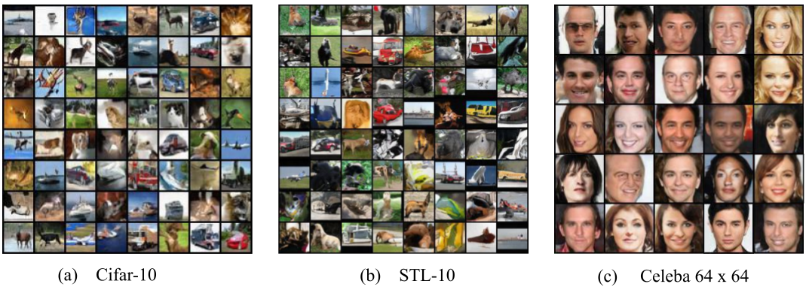

# TransGAN: Two Transformers Can Make One Strong GAN
Code used for [TransGAN: Two Transformers Can Make One Strong GAN](https://arxiv.org/abs/2102.07074). 

## Main Pipeline


## Visual Results


### prepare fid statistic file
 ```bash
mkdir fid_stat
 ```
Download the pre-calculated statistics
([Google Drive](https://drive.google.com/drive/folders/1UUQVT2Zj-kW1c2FJOFIdGdlDHA3gFJJd?usp=sharing)) to `./fid_stat`.

### Environment
```bash
pip install -r requirements.txt
```
Notice: Pytorch version has to be <=1.3.0 !

### Training
Coming soon

### Testing
Firstly download the checkpoint from ([Google Drive](https://drive.google.com/drive/folders/1Rv7ycxFKBzXPpoqw6bdjj0cNtmaei0lM?usp=sharing)) to `./pretrained_weight`
```bash
# cifar-10
sh exps/cifar10_test.sh

# stl-10
sh exps/stl10_test.sh
```

## Acknowledgement
Codebase from [AutoGAN](https://github.com/VITA-Group/AutoGAN), [pytorch-image-models](https://github.com/rwightman/pytorch-image-models)

## Citation
if you find this repo is helpful, please cite
```
@misc{jiang2021transgan,
      title={TransGAN: Two Transformers Can Make One Strong GAN}, 
      author={Yifan Jiang and Shiyu Chang and Zhangyang Wang},
      year={2021},
      eprint={2102.07074},
      archivePrefix={arXiv},
      primaryClass={cs.CV}
}
```
